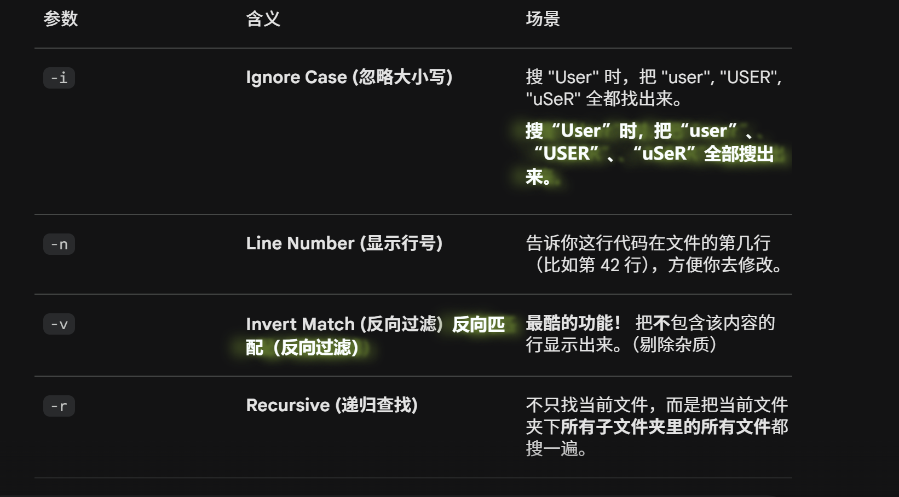

- `cd -`与上一个目录切换
- `.` `..`
- `/` `~`
- `ls ..`
- `pwd`
- `-r`
- `-f`
- `-i`
- `-n`
- `-v`
- `mv`
- `cp -r`
- `rm -r`
- `ctrl+c`终止
- `ctrl+l`\=\=clear
- `^`
- `$`
- `\b`
- `[]`
- `[^]`
- `.`
- `-i`
- `-n`
- `-r`
- `-v`
- 
- `?`
- `+`
- `|`
- 