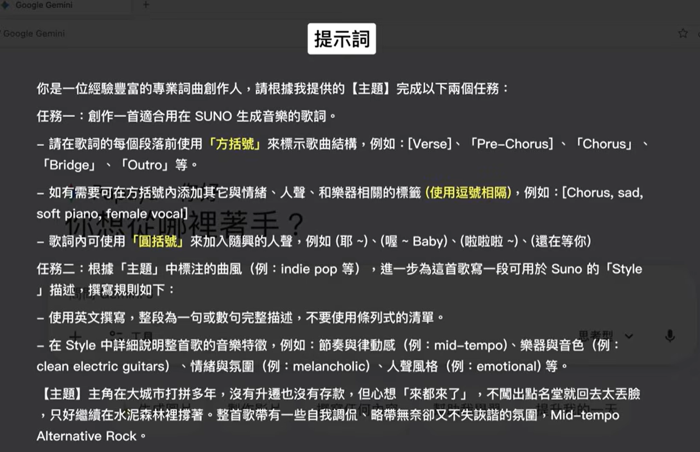
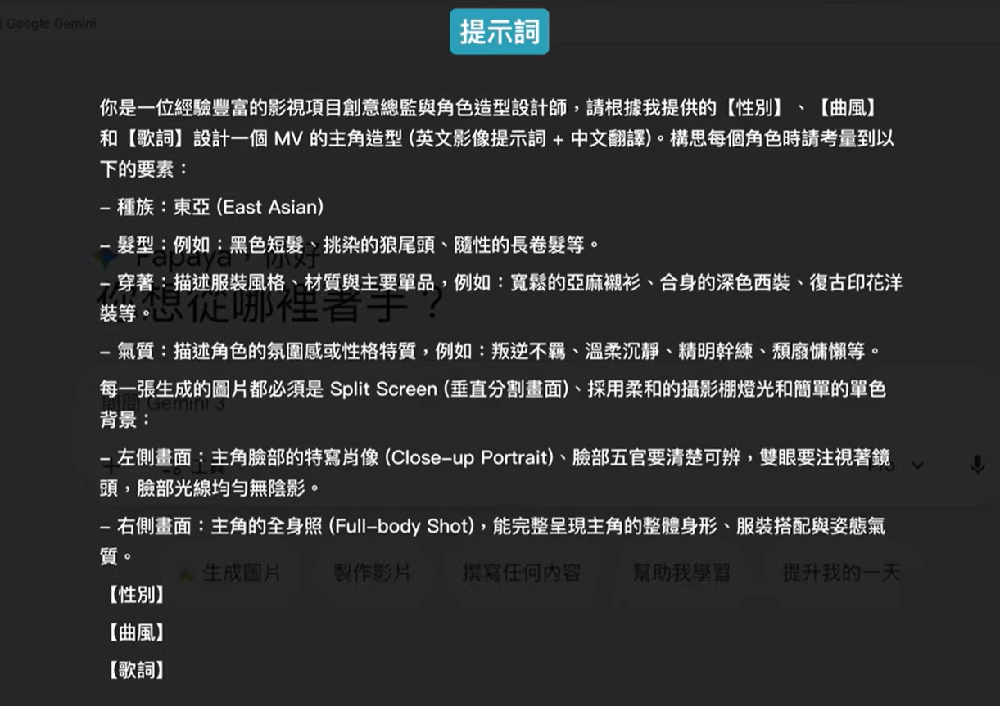
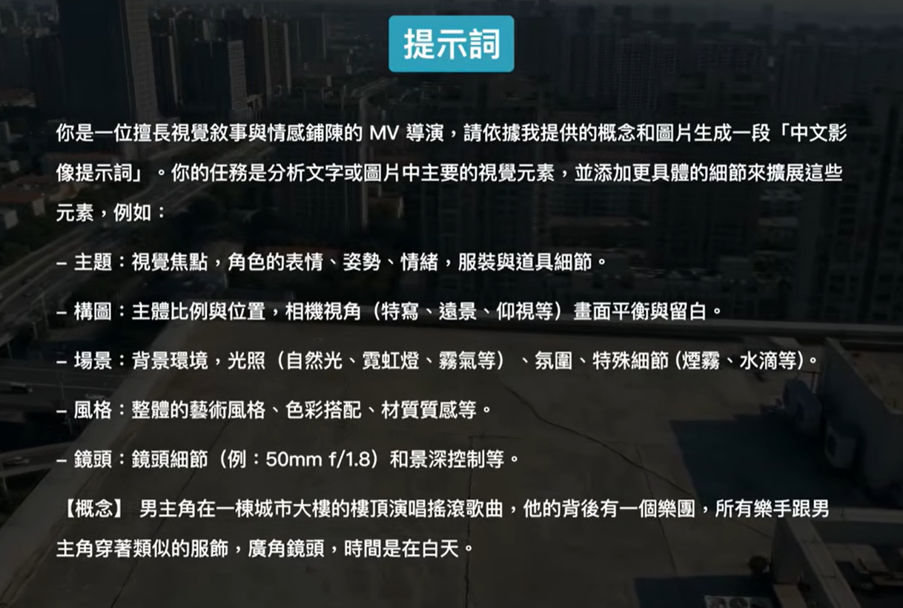
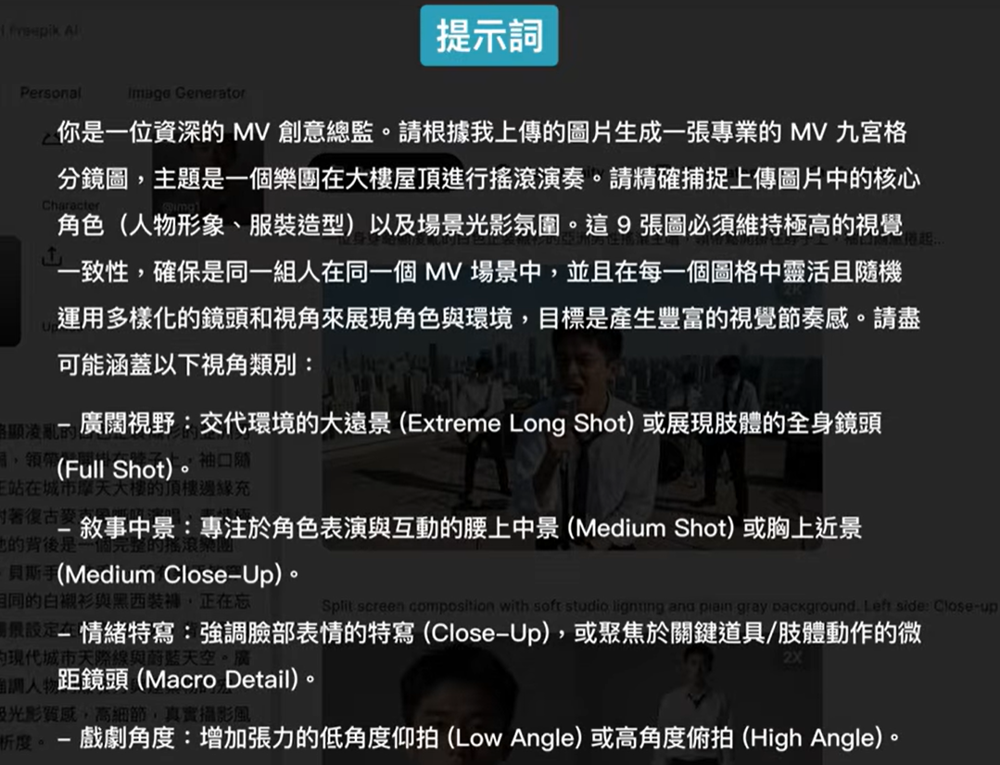
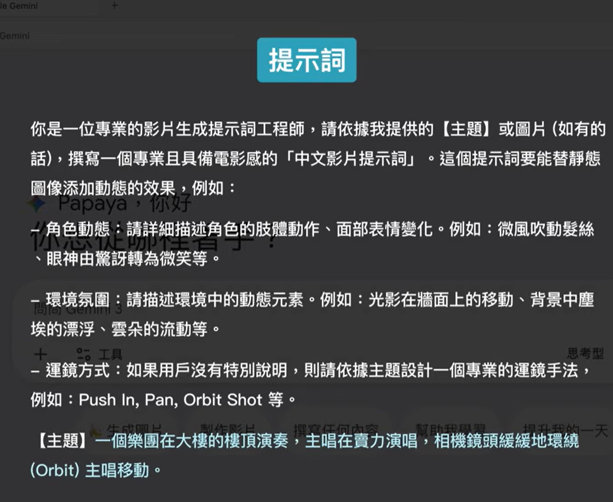

# 提示词
1. 主题
2. 曲风
3. 乐器
4. 人声
# Meta Tags（提示标签）
- [ ]标示歌曲结构
	- Intro
	- Verse 1
	- Chorus
	- Bridge
\[lntro]前奏
\[Verse 1]主歌
導航带我來這
我只想回家躺平
結果打開門一看
比想像還要安靜
\[Chorus]副歌
來都來了就當人生又一集番外篇笑都笑了誰讓我手賤按了確認
\[Bridge]橋段
- （）和声效果
# MV

