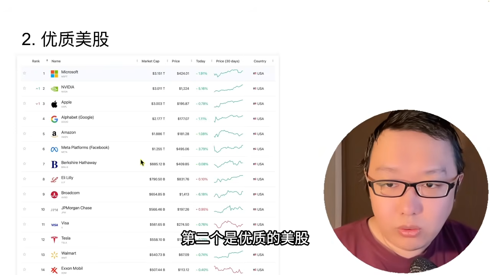
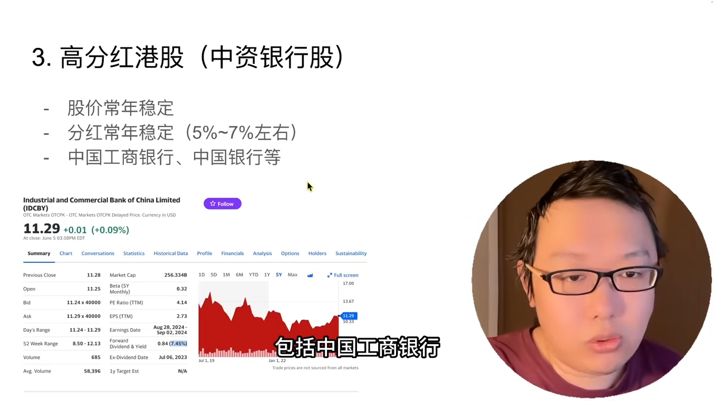
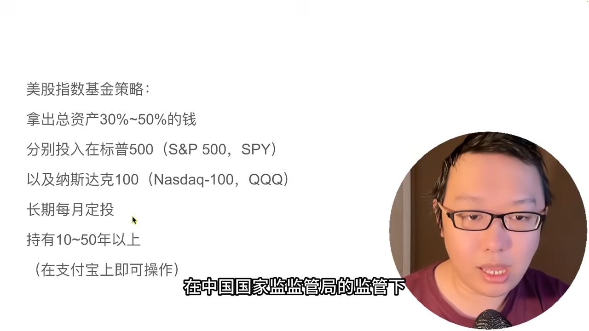
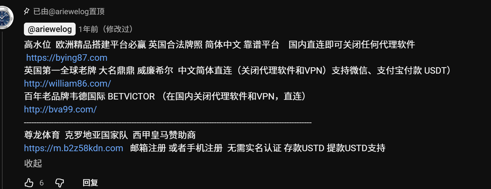
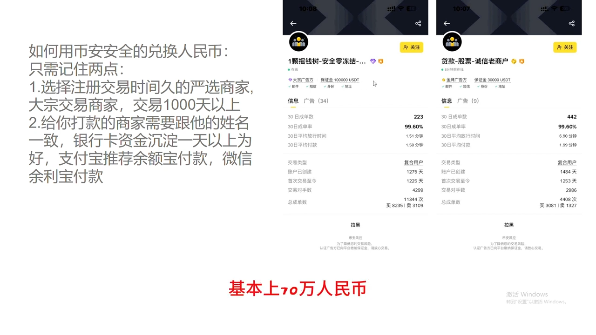

# 密码
637578
# 股票

# 基金

这是一个非常经典的问题。在投资界，答案并不是“越多越好”，也不是“越少越好”，而是讲究一个**“黄金平衡点”**。

简单直接的结论是：**对于普通投资者，持有 3-5 只互补的基金是效果最好的。**

为了帮您做决定，我们需要识破一个名为**“假分散”**的陷阱，并理解**“资产配置”**的真正含义。

---

### 一、 这是一个常见的误区：买得多 ≠ 分散风险

很多新手觉得：“既然不能把鸡蛋放在同一个篮子里，那我就买 10 只基金，是不是就安全了？”

**大错特错！** 请看以下两个场景：

- **场景 A（无效分散）：**
    
    - 您买了：易方达标普500、博时标普500、天弘标普500、摩根标普500。
        
    - **结果：** 您买了 4 只基金，但这 4 只基金买的股票**全是美国那 500 家公司**。美股一跌，这 4 只基金一起跌。您只是把钱分成了 4 份，并没有分散风险。这叫**“重复建设”**。
        
- **场景 B（假分散）：**
    
    - 您买了：招商白酒、易方达消费、鹏华酒、汇添富消费。
        
    - **结果：** 虽然名字不同，但它们的持仓大同小异（都是茅台、五粮液）。白酒板块一塌，您的账户全军覆没。
        

**结论：** 如果买的基金**“相关性”**太高，买 100 只也没用。

---

### 二、 为什么建议持有 3-5 只？（真正的资产配置）

真正的分散，是要找到**“性格不合”**的几个资产。

- **当A跌的时候，B可能会涨；**
    
- **当B不动的时候，C在赚钱。**
    

这就是**“东边不亮西边亮”**。持有 3-5 只**不同类型**的基金，可以达到最佳性价比：

1. **管理成本低：** 每天看 3 个净值很容易，每天看 20 个净值会让人焦虑。
    
2. **风险对冲：**
    
    - **组合示例：** 美股（标普500） + A股（沪深300） + 黄金。
        
    - **效果：** 美股跌了，可能黄金在涨；A股跌了，可能美股在涨。您的账户总资产会是一条**平滑向上的曲线**，而不是上蹿下跳的心电图。
        

---

### 三、 什么时候适合“只投一只基金”？

虽然多只基金能平滑波动，但在一种情况下，**只投一只**也是完全正确的策略：

**情况：您的资金量较小（比如 1 万元以内），且选的是“宽基指数”。**

- **理由：**
    
    - 像**标普500**或**沪深300**这种指数基金，它本身就已经是一个包含了 300-500 家公司的“超级大果篮”了。
        
    - 买这一只，您就已经分散到了几百家公司里，足够安全。
        
    - 如果您只有 1000 元，非要拆成 5 份去买 5 只基金，每只才 200 元，不仅操作麻烦，而且意义不大。
        

---

### 四、 实操建议：如何搭建您的“积木”？

根据您的资金量和经验，建议您按照以下阶段进阶：

#### 第一阶段：新手期（资金 < 1万元）

- **策略：** **All in 一只核心基金。**
    
- **推荐：** 全仓 **标普500**（或 纳斯达克100）。
    
- **理由：** 集中火力，积累本金。这时候本金少，就算跌 20% 也就亏几百块，不需要复杂的对冲。
    

#### 第二阶段：进阶期（资金 1万 - 10万元）

- **策略：** **核心 + 卫星（两只）。**
    
- **配置：**
    
    - **70%：** 标普500（稳健增长）。
        
    - **30%：** 纳斯达克100（追求高收益，增强进攻性）。
        
- **理由：** 开始尝试不同风格，但都在美股体系内，享受国运。
    

#### 第三阶段：成熟期（资金 > 10万元）

- **策略：** **全球资产配置（三到四只）。**
    
- **配置（经典的“永久组合”变体）：**
    
    - **40% 美股：** 标普500 / 纳指100（进攻）。
        
    - **30% A股：** 沪深300 / 中证红利（防守+分红）。
        
    - **20% 债券/固收：** 应对股市崩盘。
        
    - **10% 黄金/石油：** 对冲极端风险。
        
- **理由：** 这时候本金多了，**“不亏钱”**比“赚大钱”更重要。利用不同国家的资产对冲风险。
    

---

### 总结

1. **拒绝重复：** 不要同时买两只跟踪同一个指数的基金（比如不要同时买易方达标普500和博时标普500），选一只费率低、额度足的就行。
    
2. **不要太杂：** 除非资金超过 50 万，否则基金数量**不要超过 5 只**。太杂了您管不过来，而且收益会被平庸的基金拖累。
    
3. **互补才是王道：** 美股+A股，或者 股票+黄金，才是有效的分散。
    

**您目前的资金量大概处于哪个阶段？如果您想开始组建“双核驱动”（美股+A股）的组合，想知道怎么分配比例最科学吗？**
# 彩票
## 体彩

- 赔率
- 返还率
- 对冲

## 福利彩票
[[2026-01-24]]中了￥800（本金￥100）
[[2026-01-29]]赌球中￥196.5（本金￥100）
[[2026-01-30]]赌球中￥269.5（本金￥100），未中￥20
[[2026-01-31]]赌球一半中一半不中￥97.5（本金￥100），未中￥100
# ***目前共中￥943.5***
