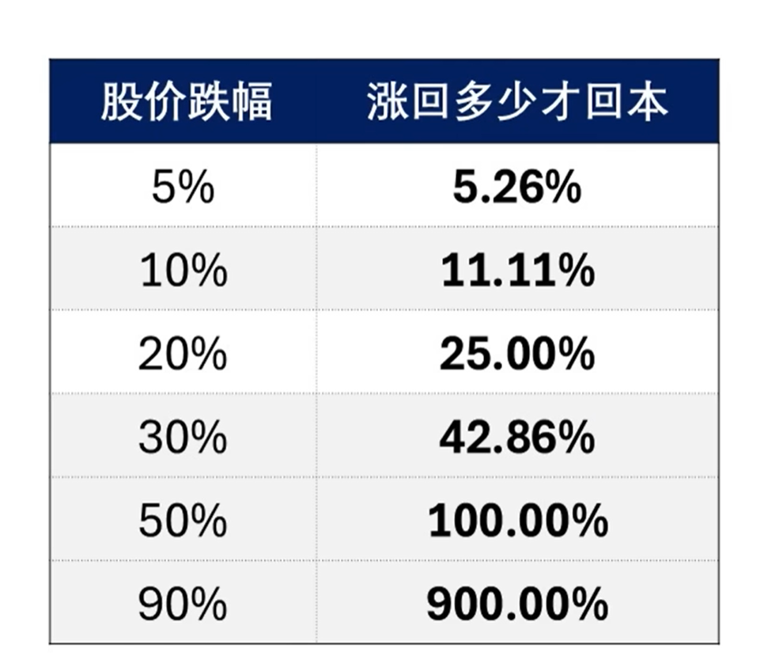
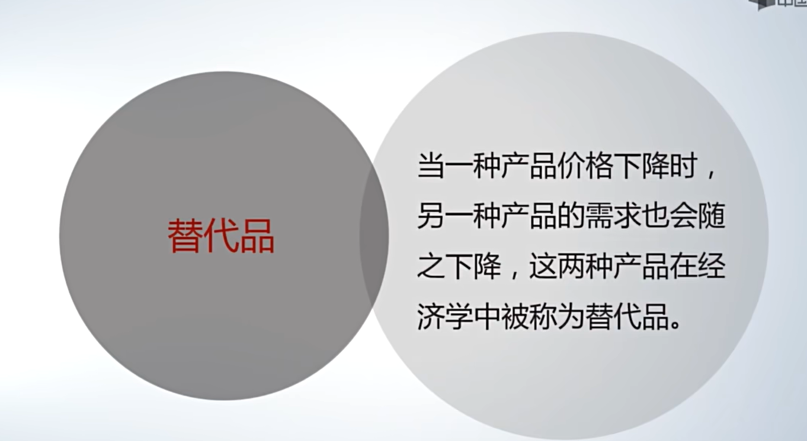
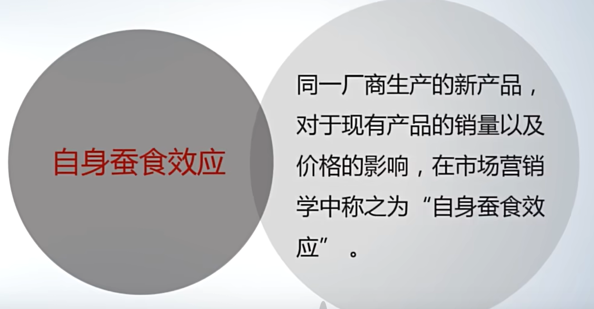
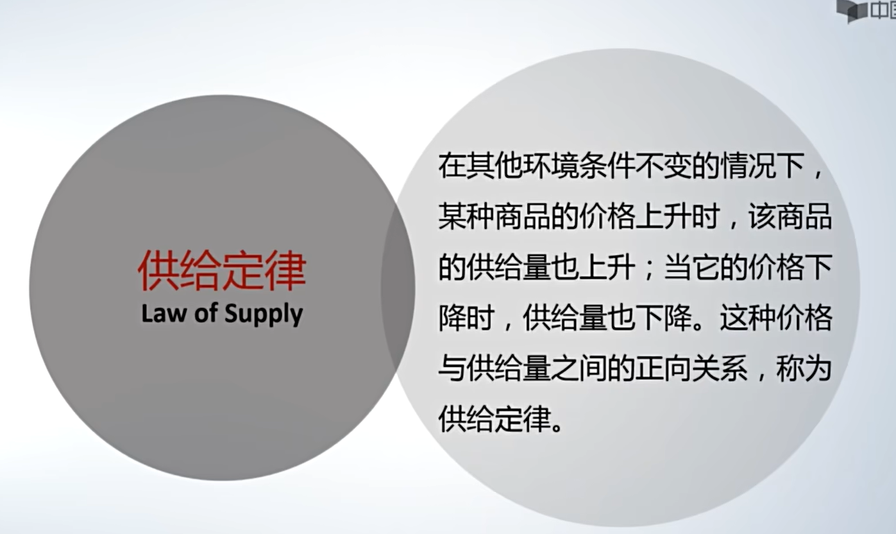
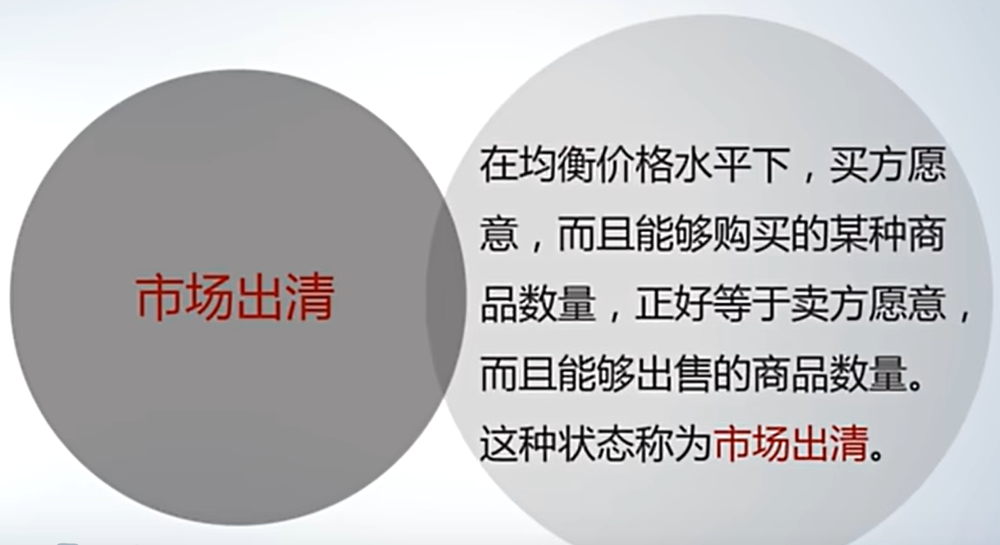

# 1.沉没成本
### ==决策时，不应考虑沉没成本==
# 2.金钱的时间价值
### ==今天的一块钱比明天的一块钱更有价值。== ==（钱可以赚取利息）==
- 现值
- 未来价值
- 内涵回报率（IRR internal rate of return)
- 考虑金额和现金流入的时间点 
# 3.股价

$$\huge\frac{跌幅}{ 1-跌幅}$$
# 4.影响需求因素
- 需求量变化，需求变化

